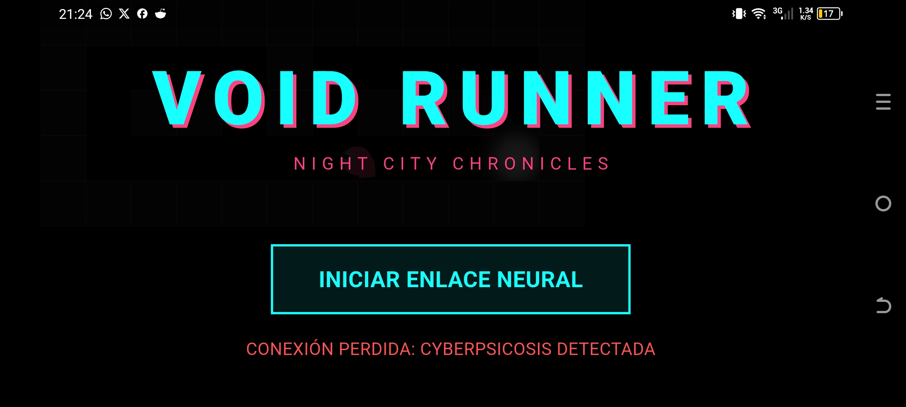
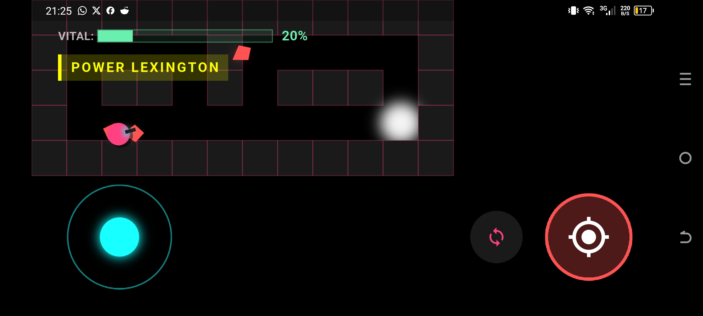
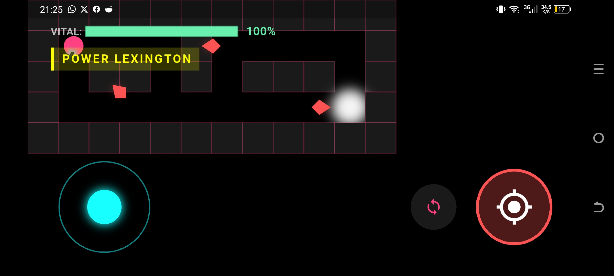

# void_runner_2d

Proyecto inspirado en el juego Doom, realizado en Flutter, con el proposito de experimentar y entender el desarollo de juegos con Flutter y Dart. Este proyecto se debe al esfuerzo y la dedidicacion de conocimientos que brindo el profesor Edgar para que esto fuera posible

## Caracteristicas

El juego cuenta con 3 niveles, cada uno con diferentes enemigos y desafios. Ademas, el juego cuenta con un sistema de armas, un sistema de power-ups, un sistema de efectos visuales y un sistema de sonido.

## Como jugar

El juego se puede jugar con el teclado o con el mouse. El teclado se puede usar para mover al personaje y para disparar. El mouse se puede usar para apuntar y para disparar.

## Como funciona el GameLoop

El Gameloop se implemento para poder estructurar el juego y como iria su funcionamiento, este se encarga de actualizar el estado del juego en cada frame, es decir, se encarga de actualizar la posicion de los enemigos, la posicion del jugador, la posicion de las balas, la posicion de los power-ups, la posicion de los efectos visuales y la posicion de los sonidos. Cuando se ejecuta el juego, se pueden ver los FPS en la esquina superior derecha, esto es gracias al GameLoop. Tambien se puede ver como todos los detalles por las funciones que se programaron en cada uno de los archivos se complementan en conjunto para  hacer esta version fanmade del Doom2d con un estilo inspirado en Cyberpunk 2077 y Cyberpunk Edgerunners

## Como instalarlo

Para poder instalar el juego, se debe tener instalado Flutter y Dart. Luego, se debe clonar el repositorio y ejecutar el comando "flutter run" en la terminal. Una vez ejecutado el comando, mostrara las opciones donde puede funcionar en el mismo, principalmente mostrara para funcionar en los navegadores en el computador o en el mismo computador, tambien tendra un apk que se podra instalar con ninguna complicacion en el celular, solo se debe tener instalado Expo Go en el celular y ubicar en los archivos el apk para poder instalarlo en el celular, Para que funcione en la App .

## Como funciona el juego

El juego funciona de la siguiente manera:

1. El jugador aparece en el nivel 1
2. El jugador debe matar a todos los enemigos para poder pasar al siguiente nivel
3. El jugador debe evitar ser golpeado por los enemigos
4. El jugador debe recoger los power-ups para poder mejorar sus armas
5. El jugador debe recoger los efectos visuales para poder mejorar sus efectos visuales
6. El jugador debe recoger los sonidos para poder mejorar sus sonidos
7. El jugador debe llegar al final del nivel para poder pasar al siguiente nivel
8. El jugador debe llegar al final del juego para poder ganar

## Capturas del juego en funcionamiento

    

